# Architecture — Unified Login CoreMigration

| Field | Value |
|---|---|
| **Version** | 2.0 (net10.0 / CoreMigration branch) |
| **Date** | 2026-02-26 |
| **Branch** | `CoreMigration` |
| **Original Baseline** | .NET Framework 4.8 |

---

## Table of Contents

1. [System Context (C4 Level 1)](#1-system-context-c4-level-1)
2. [Container View (C4 Level 2)](#2-container-view-c4-level-2)
3. [Component View (C4 Level 3)](#3-component-view-c4-level-3)
4. [Runtime Views — Sequence Diagrams](#4-runtime-views--sequence-diagrams)
5. [Deployment View](#5-deployment-view)
6. [Quality Attributes](#6-quality-attributes)
7. [Migration Notes from .NET Framework 4.8](#7-migration-notes-from-net-framework-48)
8. [Changelog](#changelog)

---

## 1. System Context (C4 Level 1)

The **Unified Login** system is the identity and user-management hub for the RealPage SaaS platform. It authenticates users, manages product access, and synchronizes user/role data to downstream product systems.

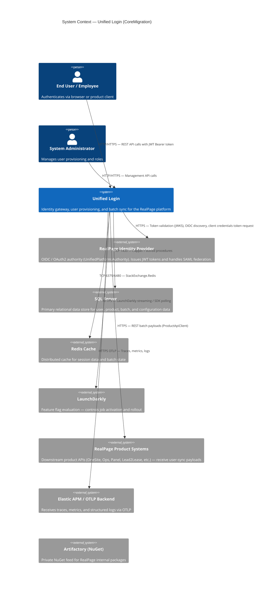

---

## 2. Container View (C4 Level 2)

The solution deploys as three independent containers, backed by shared infrastructure.

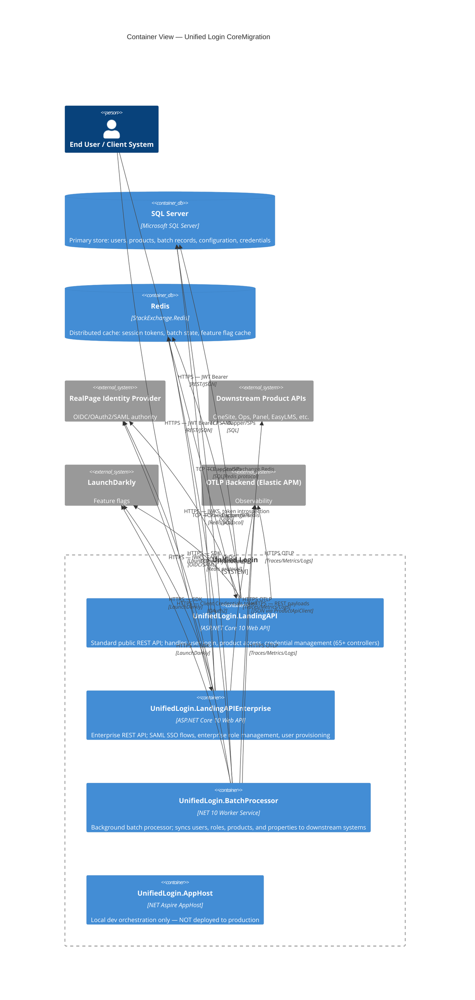

---

## 3. Component View (C4 Level 3)

### 3.1 LandingAPI Components

```mermaid
C4Component
    title Component View — UnifiedLogin.LandingAPI

    Container_Boundary(landing, "UnifiedLogin.LandingAPI") {
        Component(prog, "Program.cs", "Top-level statements", "Builds WebApplication; registers services; configures middleware pipeline")
        Component(mw_fwd, "ForwardedHeaders Middleware", "ASP.NET Core Middleware", "Extracts X-Forwarded-* headers from reverse proxy")
        Component(mw_auth, "Authentication Middleware", "JwtBearer / OIDC", "Validates JWT tokens against UnifiedPlatform Authority")
        Component(mw_authz, "Authorization Middleware", "AuthorizeFilter", "Enforces RequireAuthenticatedUser globally")
        Component(mw_scope, "UnifiedLoginUserScopeMiddleware", "Custom Middleware", "Enriches ambient scope with user identity/claims")
        Component(mw_exc, "ExceptionHandler Middleware", "ASP.NET Core", "Catches unhandled exceptions; returns RFC 7807 Problem Details")
        Component(ctrl, "Controllers (65+)", "ASP.NET Core MVC Controllers", "Domain controllers: User, Product, Access, Credential, MFA, Organization, etc.")
        Component(filter_init, "InitializeUserRightsFilter", "IActionFilter", "Pre-populates user rights context before action execution")
        Component(binder, "RequestParameterModelBinder", "IModelBinderProvider", "Custom binding for RequestParameter objects")
        Component(swagger, "SwaggerDocumentation", "Swashbuckle + OAuth2 PKCE", "OpenAPI spec with OAuth2 PKCE flow")
        Component(base_ctrl, "BaseController", "Abstract MVC Controller", "Provides IUserClaimsAccessor, PersonaId, UserId to all controllers")
    }

    Container_Boundary(core, "UnifiedLogin.Core (library)") {
        Component(auth_ext, "AuthorizationExtensions", "IServiceCollection extension", "Adds global AuthorizeFilter")
        Component(biz_ext, "BusinessLogicExtensions", "IServiceCollection extension", "Registers 100+ IManage*, IRepository services")
        Component(ld_ext, "LaunchDarklyExtensions", "IServiceCollection extension", "Registers ILdClient singleton")
        Component(json_ext, "JsonSerializationExtensions", "Newtonsoft.Json config", "CamelCase, GuidConverter, NullValueHandling.Include")
        Component(kafka_stub, "KafkaExtensions", "Stub — NOT active", "Empty AddKafka() method")
    }

    Container_Boundary(bl, "UnifiedLogin.BusinessLogic (library)") {
        Component(manage, "IManage* Services (100+)", "Business logic", "ManageUser, ManageProduct, ManageCredential, ManageSaml, etc.")
        Component(repos, "IRepository implementations (40+)", "Repository pattern", "UserRepository, ProductRepository, PersonaRepository, etc.")
        Component(redis_svc, "IRedisCacheService", "Cache abstraction", "Wraps StackExchange.Redis")
    }

    Container_Boundary(da, "UnifiedLogin.DataAccess (library)") {
        Component(dapper, "Dapper extensions", "RealPage.DataAccess.Dapper", "GetManyAsync, GetAsync, ExecuteAsync wrappers")
    }

    Container_Boundary(sd, "UnifiedLogin.ServiceDefaults (library)") {
        Component(otel_cfg, "OpenTelemetry Config", "OTLP exporter", "Traces, metrics, OTLP export")
        Component(serilog_cfg, "Serilog Config", "OTLP + Console + File", "Structured logging")
        Component(health_ep, "Health Endpoints", "/health, /alive", "ASP.NET Core HealthChecks")
        Component(prob_details, "Problem Details", "RFC 7807", "Standardized error format with traceId/spanId")
    }

    Rel(prog, mw_fwd, "registers")
    Rel(prog, mw_auth, "registers")
    Rel(prog, mw_authz, "registers")
    Rel(prog, mw_scope, "registers")
    Rel(prog, mw_exc, "registers")
    Rel(prog, ctrl, "maps endpoints")
    Rel(prog, auth_ext, "calls")
    Rel(prog, biz_ext, "calls")
    Rel(prog, ld_ext, "calls")

    Rel(ctrl, base_ctrl, "inherits")
    Rel(ctrl, manage, "uses via DI")
    Rel(manage, repos, "uses")
    Rel(repos, dapper, "uses")
    Rel(manage, redis_svc, "uses")
```

### 3.2 BatchProcessor Components

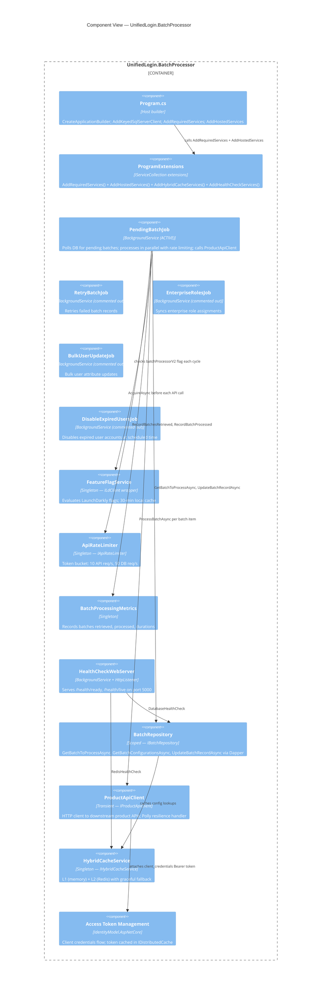

### 3.3 Cross-Cutting Concerns

```mermaid
graph TB
    subgraph "Cross-Cutting Concerns"
        Auth["Authentication<br/>(JwtBearer / OIDC / SAML)"]
        Authz["Authorization<br/>(RequireAuthenticatedUser global filter)"]
        Logging["Structured Logging<br/>(Serilog → OTLP / Console / File)"]
        Tracing["Distributed Tracing<br/>(OpenTelemetry → OTLP)"]
        Metrics["Metrics<br/>(OTel AspNetCore + HttpClient + Runtime)"]
        FF["Feature Flags<br/>(LaunchDarkly — 30-min cache)"]
        Cache["Caching<br/>(IMemoryCache / Redis / HybridCache)"]
        Resilience["Resilience<br/>(Polly retry + circuit breaker + timeout)"]
        Validation["Input Validation<br/>(FluentValidation + Model binders)"]
        Health["Health Checks<br/>(/health, /alive, port 5000)"]
        ProbDetails["Error Responses<br/>(RFC 7807 Problem Details + traceId)"]
    end

    subgraph "Services"
        LA["LandingAPI"]
        EA["LandingAPIEnterprise"]
        BP["BatchProcessor"]
    end

    Auth --> LA
    Auth --> EA
    Authz --> LA
    Authz --> EA
    Logging --> LA
    Logging --> EA
    Logging --> BP
    Tracing --> LA
    Tracing --> EA
    Tracing --> BP
    Metrics --> LA
    Metrics --> EA
    Metrics --> BP
    FF --> LA
    FF --> EA
    FF --> BP
    Cache --> LA
    Cache --> EA
    Cache --> BP
    Resilience --> LA
    Resilience --> EA
    Resilience --> BP
    Validation --> LA
    Validation --> EA
    Health --> LA
    Health --> EA
    Health --> BP
    ProbDetails --> LA
    ProbDetails --> EA
```

---

## 4. Runtime Views — Sequence Diagrams

### 4.1 Authentication Flow (JWT Bearer / OIDC)

This diagram shows the flow for an authenticated API request to `UnifiedLogin.LandingAPI`.

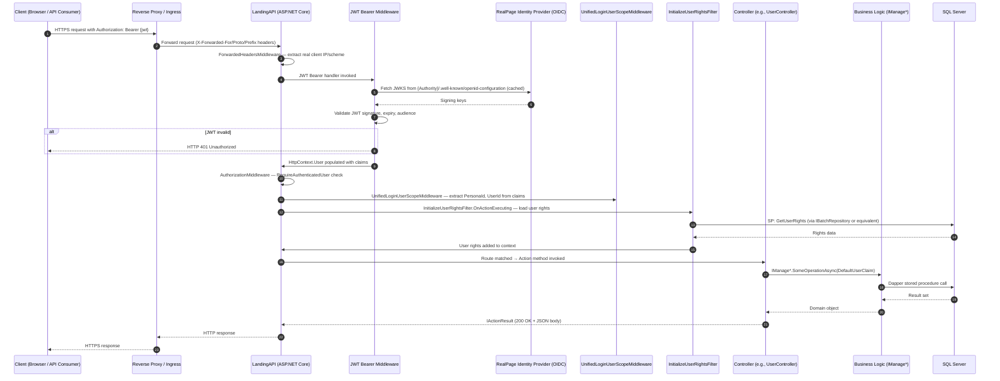

### 4.2 SAML Enterprise SSO Flow (LandingAPIEnterprise)

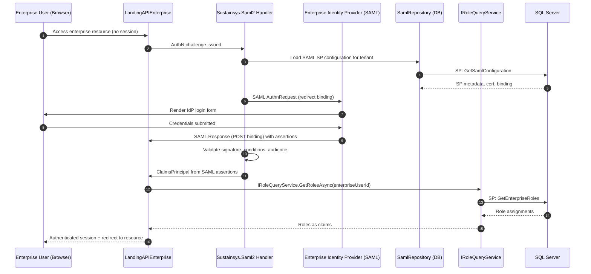

### 4.3 Batch Processing Flow (PendingBatchJob)

```mermaid
sequenceDiagram
    autonumber
    participant Job as PendingBatchJob (BackgroundService)
    participant FF as FeatureFlagService (LaunchDarkly)
    participant LD as LaunchDarkly
    participant Rate as ApiRateLimiter
    participant DB as SQL Server
    participant Cache as HybridCacheService (Redis + Memory)
    participant IdP as RealPage Identity Provider
    participant TokenMgr as AccessTokenManagement
    participant ProdAPI as Downstream Product API

    loop Every TimeIntervalInSeconds (10s)
        Job->>FF: GetBoolFlagAsync("batchProcessorV2")
        FF->>Cache: Check flag cache (30-min TTL)
        alt Cache miss
            Cache-->>FF: miss
            FF->>LD: Evaluate flag
            LD-->>FF: bool value
            FF->>Cache: Store result
        end
        Cache-->>FF: bool value
        FF-->>Job: isBatchProcessorV2Enabled

        alt Feature flag disabled
            Job->>Job: Delay(TimeInterval); continue
        end

        Job->>DB: GetBatchToProcessAsync(batchSize=5, SP_ListBatch)
        DB-->>Job: List<Batch> (pending records)

        Job->>Cache: GetBatchConfigurationsAsync (endpoint configs, cached)
        Cache-->>Job: Dictionary<BatchProcessTypeId, endpoint>

        par Parallel.ForEachAsync (max 5 concurrent)
            Job->>Rate: AcquireAsync("api") — token bucket
            Rate-->>Job: Lease (acquired/denied)
            alt Lease denied
                Job->>Job: Skip batch, retry next cycle
            end

            Job->>TokenMgr: Get cached client_credentials token
            alt Token expired
                TokenMgr->>IdP: POST /connect/token (client_credentials)
                IdP-->>TokenMgr: access_token (cached in IDistributedCache)
            end

            Job->>ProdAPI: POST {ProcessApiEndPoint} with BatchProcessorInput + Bearer token
            Note over ProdAPI: Polly: 3 retries, exp backoff, circuit breaker
            ProdAPI-->>Job: HTTP 200 (success response)

            alt API call failed after retries
                Job->>DB: UpdateBatchRecordAsync(Error, SP_UpdateBatch)
            end
        end

        Job->>Job: RecordMetrics(success, failure, duration)
        Job->>Job: Delay(TimeInterval)
    end
```

### 4.4 Cache Read Flow (HybridCache)

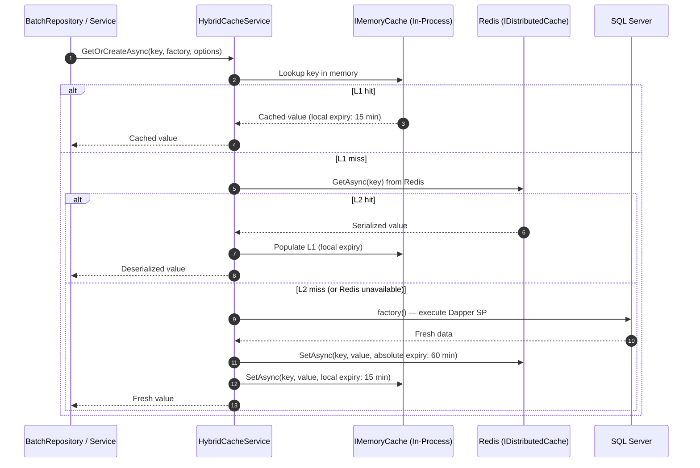

---

## 5. Deployment View

### 5.1 Environment Topology

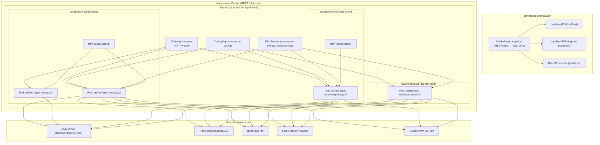

### 5.2 Kubernetes Resource Summary

| Resource | Type | Service | Key Settings |
|---|---|---|---|
| `unified-login-coreapiv2` | Deployment | LandingAPI | `replicas: $(K8s.LandingApiReplicas)`, CPU: 200m–500m, Mem: 256Mi–1Gi |
| `unified-login-coreenterpriseapiv2` | Deployment | LandingAPIEnterprise | Similar to LandingAPI |
| `unifiedlogin-batchprocessorv2` | Deployment | BatchProcessor | Single replica (worker service pattern) |
| `*-hpa` | HorizontalPodAutoscaler | LandingAPI, EnterpriseAPI | Auto-scales based on CPU/memory |
| `*-configmap` | ConfigMap | All | Non-secret environment config |
| `*-secrets` (from template) | Secret | All | DB connection strings, client secrets, Redis auth |
| `*-httproute` | HTTPRoute (Gateway API) | LandingAPI, EnterpriseAPI | L7 routing via gateway ingress |
| `*-service` | Service (ClusterIP) | All | Internal cluster routing |

**Security context (all pods):**
```yaml
securityContext:
  runAsNonRoot: true
  runAsUser: 10000
```

**Docker base image:** `mcr.microsoft.com/dotnet/aspnet:10.0-noble`
**Additional packages in image:** `gss-ntlmssp` (Kerberos/NTLM support for SQL Server auth)

Source: `CoreMigration/K8s/rancher/`

### 5.3 Container Image Build

Multi-stage Dockerfile (`Services/UnifiedLogin.BatchProcessor/Dockerfile`):

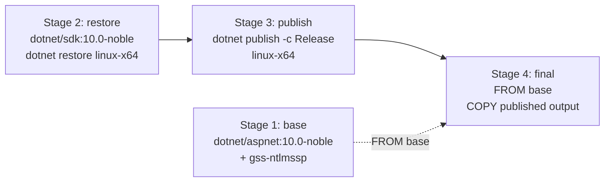

### 5.4 CI/CD Pipeline (Azure Pipelines)

Entry point: `CoreMigration/azure-pipelines.yml`

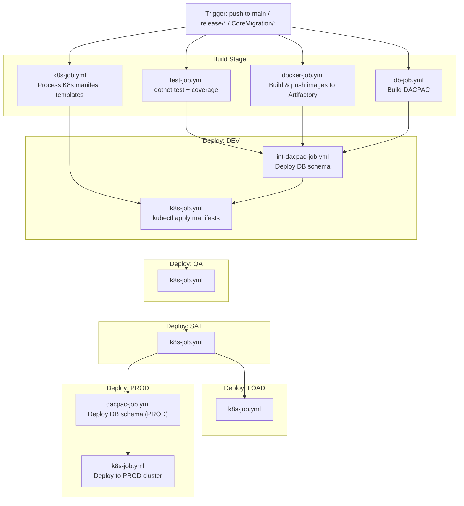

**Build variables:**
- `BuildConfiguration: Release`
- `ArtifactoryDockerRegistry: artifacts.realpage.com/docker-virtual/uty/public/unifiedloginmaincore`
- `ArtifactoryDeployablesPath: rp-deployables-local/uty/unifiedloginmaincore/$(Build.BuildNumber)`

**Image tag format:** `$(K8s.LandingApiImage):$(BUILD_BUILDNUMBER)`

**SonarQube scan:** Enabled by default (parameter: `SonarQubeScan: true`)

---

## 6. Quality Attributes

### 6.1 Performance

| Tactic | Implementation | Location |
|---|---|---|
| Three-tier caching | IMemoryCache → Redis → DB | HybridCacheService; LandingAPI in-memory |
| Parallel batch processing | `Parallel.ForEachAsync` (configurable parallelism) | PendingBatchJob |
| Configuration pre-fetch | Batch configs loaded once per job cycle | PendingBatchJob:111-115 |
| Async throughout | All DB, HTTP, and cache operations are async | All repositories and services |
| Output caching for health | 10-second cache on /health, /alive | ServiceDefaults/Extensions.cs:125-128 |
| Sampling (tracing) | `TraceIdRatioBasedSampler` (1% default in DEV) | ServiceDefaults/Extensions.cs:77 |

### 6.2 Scalability

| Tactic | Implementation |
|---|---|
| Stateless API pods | No in-process session state; JWT tokens carry identity |
| Horizontal Pod Autoscaler | CPU/memory-based autoscaling for LandingAPI and EnterpriseAPI |
| Configurable batch parallelism | `MaxDegreeOfParallelism` and `InstanceCount` per job |
| Rate limiting | `IApiRateLimiter` prevents API throttling under load |
| Distributed cache (Redis) | Shared cache cluster-wide; L1 reduces Redis pressure |

### 6.3 Security

| Tactic | Implementation |
|---|---|
| Token-based auth | JWT Bearer + OIDC; no cookie-based sessions for APIs |
| SAML federation | Sustainsys.Saml2 for enterprise IdP federation |
| Client credentials (machine-to-machine) | IdentityModel.AspNetCore for BatchProcessor outbound calls |
| Non-root containers | `runAsUser: 10000` in K8s security context |
| Global authorization | `RequireAuthenticatedUser` applied to all routes |
| Secret injection | K8s secrets → env variables; not stored in images |
| CORS allowlisting | Explicit origin allowlist from config |
| Forwarded headers | Trusted proxy header extraction |

### 6.4 Reliability

| Tactic | Implementation |
|---|---|
| Retry with jitter | Polly exponential backoff: 2s, 4s, 8s + jitter |
| Circuit breaker | Opens at 10% failure rate; 30s break |
| Per-attempt + total timeout | 15s per attempt; 90s total |
| Error isolation | Try/catch per batch item in `Parallel.ForEachAsync` |
| Graceful shutdown | `OperationCanceledException` handling in all BackgroundServices |
| Cache fallback | HybridCache falls back to L1 if Redis unavailable |
| Health probes | K8s readiness/liveness probes → automatic pod restart/traffic removal |

### 6.5 Operability / Observability

| Tactic | Implementation |
|---|---|
| Structured logs (Serilog) | JSON-structured logs with `Enrich.FromLogContext()` |
| Distributed traces (OTel) | W3C TraceContext propagation; OTLP export |
| Metrics (OTel) | Request duration, throughput, runtime (GC, thread pool) |
| Custom batch metrics | `BatchProcessingMetrics` tracks job-level KPIs |
| Problem Details | RFC 7807 errors with `traceId` and `spanId` |
| Feature flag kill switch | LaunchDarkly flags disable jobs without deployment |
| Multiple health check endpoints | `/health`, `/alive` (ASP.NET Core); `/health/ready`, `/health/live` (BatchProcessor) |
| 13-environment configs | Per-env log levels, OTLP endpoints, CORS |

---

## 7. Migration Notes from .NET Framework 4.8

### 7.1 Hosting Model

| Aspect | .NET Framework 4.8 | CoreMigration (net10.0) |
|---|---|---|
| Host | IIS / `System.Web.HttpRuntime` | Kestrel + `WebApplicationBuilder` (minimal APIs style) |
| Startup | `Global.asax` + `Startup.cs` | Top-level statements in `Program.cs` |
| Pipeline | `HttpModule` / `HttpHandler` chain | ASP.NET Core middleware pipeline |
| Worker | `IIS Application Initialization` or Windows Service | `BackgroundService` (IHostedService) |
| Orchestration | IIS App Pools | .NET Aspire (local), Kubernetes (production) |

**Key files:**
- [LandingAPI/Program.cs](../CoreMigration/UnifiedLogin.LandingAPI/Program.cs)
- [BatchProcessor/Program.cs](../CoreMigration/Services/UnifiedLogin.BatchProcessor/Program.cs)

### 7.2 Configuration

| Aspect | .NET Framework 4.8 | CoreMigration (net10.0) |
|---|---|---|
| Primary config | `web.config` / `app.config` | `appsettings.json` + environment-specific overrides |
| Transforms | `web.{env}.config` XML transforms | `appsettings.{env}.json` JSON overrides (13 environments) |
| Runtime overrides | `appSettings` XML | Environment variables (double-underscore nesting) |
| Secrets | `web.config` encryption / Azure Key Vault | Kubernetes Secrets → environment variables |
| Static access | `ConfigurationManager.AppSettings["key"]` | `ConfigReader.Initialize(IConfiguration)` static shim (retained — see tech debt #7) |

### 7.3 Authentication & Authorization

| Aspect | .NET Framework 4.8 | CoreMigration (net10.0) |
|---|---|---|
| Framework | OWIN / Katana middleware | ASP.NET Core auth middleware |
| JWT validation | `Microsoft.Owin.Security.Jwt` | `Microsoft.AspNetCore.Authentication.JwtBearer 10.0.0` |
| OIDC | `Microsoft.Owin.Security.OpenIdConnect` | `Microsoft.AspNetCore.Authentication.OpenIdConnect 10.0.0` |
| SAML | (Assumption: legacy library) | `Sustainsys.Saml2 2.11.0` |
| Authorization | `[Authorize]` + custom HTTP modules | Global `AuthorizeFilter` + `[Authorize]` attributes |
| Token acquisition | Manual `HttpClient` | `IdentityModel.AspNetCore` (client credentials flow) |

### 7.4 Serialization

| Aspect | .NET Framework 4.8 | CoreMigration (net10.0) |
|---|---|---|
| JSON library | Newtonsoft.Json | **Newtonsoft.Json retained** (backward compat) — `System.Text.Json` NOT adopted |
| Contract resolver | `CamelCasePropertyNamesContractResolver` | Same (unchanged) |
| Date format | `DateFormatConverter` (MS date format) | Same converter retained |
| Null handling | `NullValueHandling.Include` | Same (retained for API contract compat) |

### 7.5 HTTP Clients

| Aspect | .NET Framework 4.8 | CoreMigration (net10.0) |
|---|---|---|
| Pattern | `new HttpClient()` per request / `ServicePointManager` | `HttpClientFactory` + `IProductApiClient` typed client |
| Resilience | Manual retry loops / custom Polly wiring | `Microsoft.Extensions.Http.Resilience` (Polly v8 internally) |
| Service discovery | Hard-coded base URLs | `Microsoft.Extensions.ServiceDiscovery` (Aspire) |
| `ServicePointManager` | Used for SSL / connection pool | Removed — Kestrel/HttpClientHandler handles this |

### 7.6 Logging

| Aspect | .NET Framework 4.8 | CoreMigration (net10.0) |
|---|---|---|
| Framework | log4net / NLog (Assumption) | Serilog 4.3.0 |
| Integration | `log4net.config` or `NLog.config` | `Serilog.Settings.Configuration` (reads from `appsettings.json`) |
| Sinks | File / EventLog | OTLP (Elastic APM), Console, File (optional) |
| Enrichment | Manual properties | `Enrich.FromLogContext()` |
| Correlation | Manual / none | OpenTelemetry `traceId` propagation |

### 7.7 Dependency Injection

| Aspect | .NET Framework 4.8 | CoreMigration (net10.0) |
|---|---|---|
| Container | Unity / Autofac / SimpleInjector (Assumption) | `Microsoft.Extensions.DependencyInjection` (built-in) |
| Registration | Bootstrapper / Global.asax | Extension methods (`.AddRepositories()`, `.AddBusinessLogicServices()`) |
| Lifetimes | Per-request / singleton / transient | Scoped / Singleton / Transient |
| Keyed services | Not available | `AddKeyedSqlServerClient("DBConnection")` (Aspire) |

### 7.8 Data Access

| Aspect | .NET Framework 4.8 | CoreMigration (net10.0) |
|---|---|---|
| Driver | `System.Data.SqlClient` | `Microsoft.Data.SqlClient 6.0.2` |
| Query library | Dapper or direct ADO.NET (Assumption) | Dapper 2.1.66 + `RealPage.DataAccess.Dapper 1.3.1` |
| Async | Synchronous / limited async | Full async (`GetManyAsync`, `ExecuteAsync`, cancellation tokens) |
| Connection management | Manual `Open()` / `Close()` | Keyed transient via Aspire `AddKeyedSqlServerClient` |

### 7.9 WCF / SOAP

| Aspect | Status |
|---|---|
| `System.ServiceModel.*` NuGet packages | Retained in `UnifiedLogin.SharedObjects` |
| CoreWCF | Not adopted |
| REST wrappers for WCF services | Not confirmed from reviewed code |
| **Recommendation** | Audit `SharedObjects` for actual WCF client usage; if unused, remove packages; if used, evaluate CoreWCF migration or REST wrapper |

### 7.10 Recommended Next Steps

| Priority | Recommendation |
|---|---|
| High | Activate remaining batch jobs (`RetryBatchJob`, `EnterpriseRolesJob`, `BulkUserUpdateJob`, etc.) once validated |
| High | Migrate dev credentials out of `appsettings.json` into `.NET User Secrets` or Azure Key Vault dev tier |
| High | Configure Kafka (`AddKafka()`) or remove `Confluent.Kafka` package if not in roadmap |
| Medium | Enable `Nullable` in LandingAPI, LandingAPIEnterprise, BatchProcessor to reduce NullReferenceException risk |
| Medium | Evaluate migrating from Newtonsoft.Json to `System.Text.Json` for performance improvements |
| Medium | Replace `ConfigReader.Initialize()` static shim with proper `IOptions<T>` injection |
| Medium | Audit `System.ServiceModel.*` usage in `SharedObjects`; remove or migrate to CoreWCF |
| Medium | Fix `BuildServiceProvider()` anti-pattern in `AddHostedServices()` — use `IOptions<T>` deferred resolution instead |
| Low | Upgrade from Polly 7.2.3 direct dependency to Polly v8 (align with `Microsoft.Extensions.Http.Resilience` internals) |
| Low | Enable `OTEL_EXPORTER_OTLP_HEADERS` in AppHost for local developer telemetry |

---

## Changelog

| Date | Author | Summary |
|---|---|---|
| 2026-02-26 | Claude Sonnet 4.6 (AI-generated) | Initial architecture documentation of `CoreMigration` branch. Includes C4 Context, Container, and Component views (Mermaid); four sequence diagrams (JWT auth, SAML SSO, batch processing, cache read); deployment view with K8s topology and Azure Pipelines CI/CD; quality attribute tactics table; and comprehensive .NET Framework 4.8 → net10.0 migration delta analysis with prioritized next steps. |
